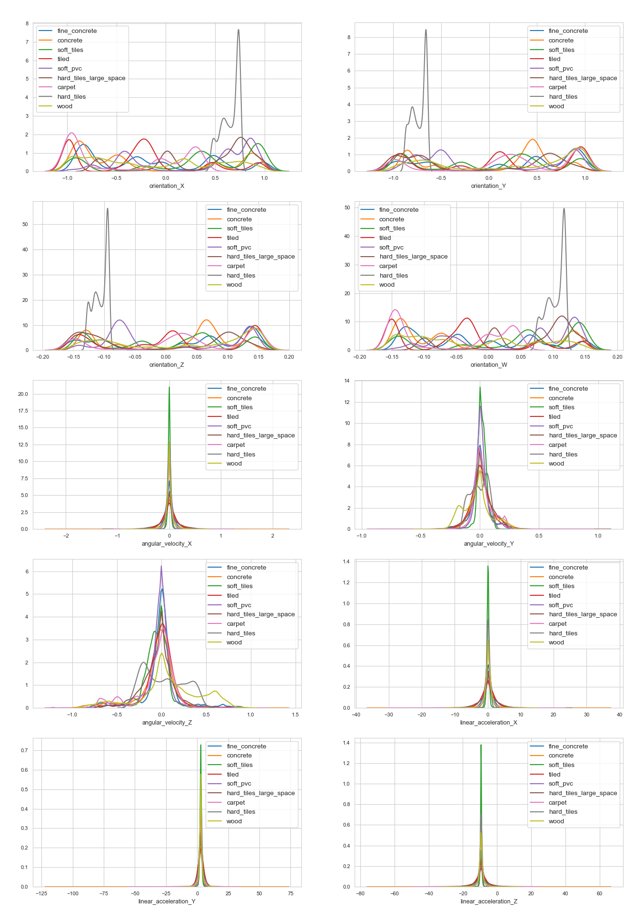
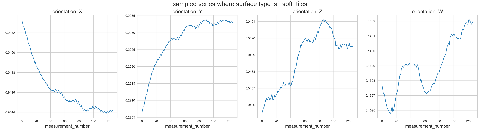
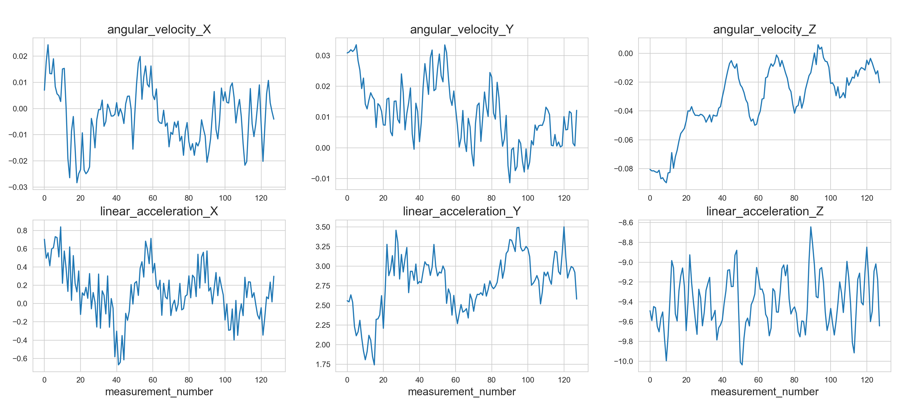
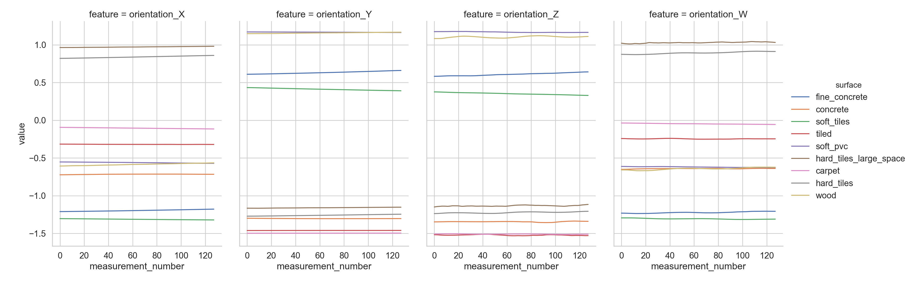
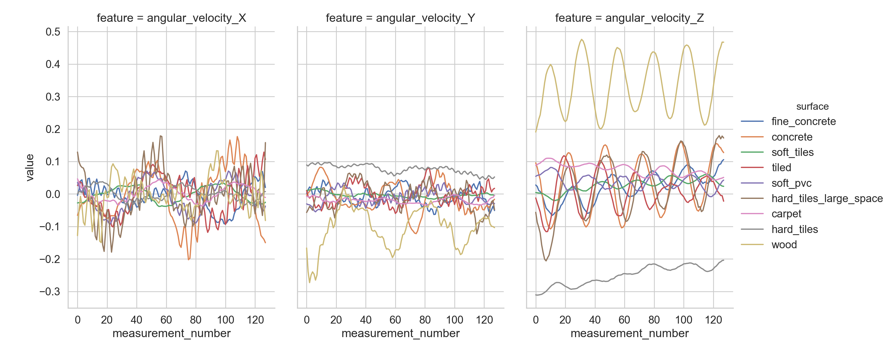
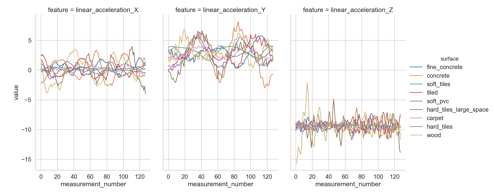
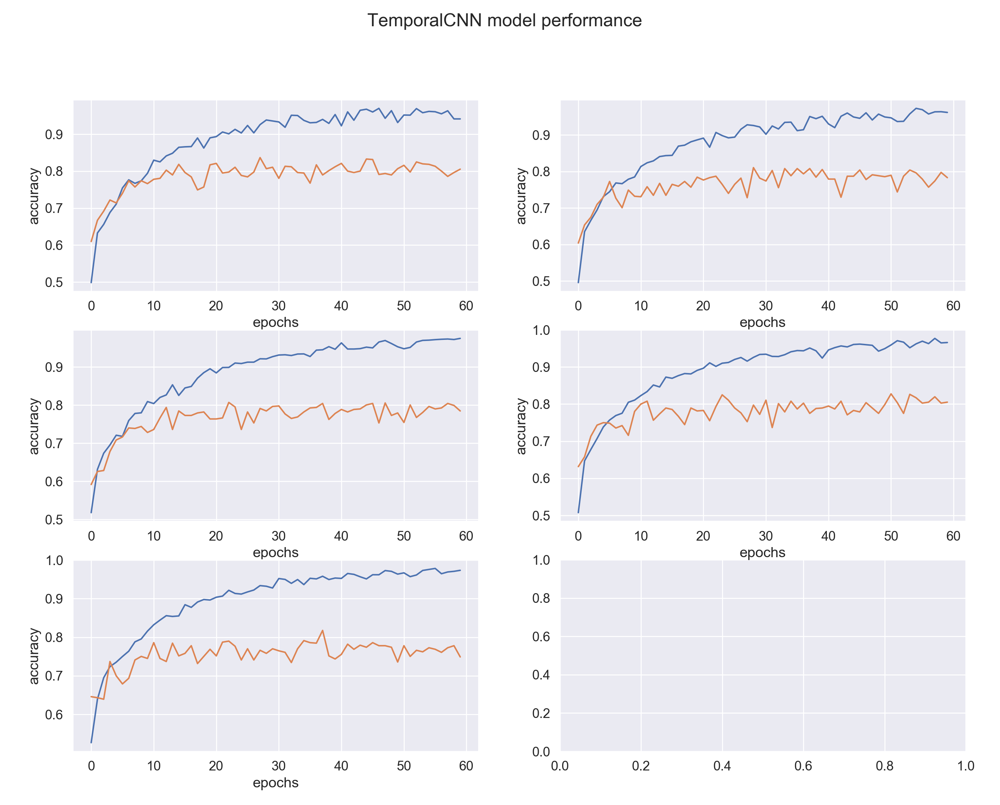
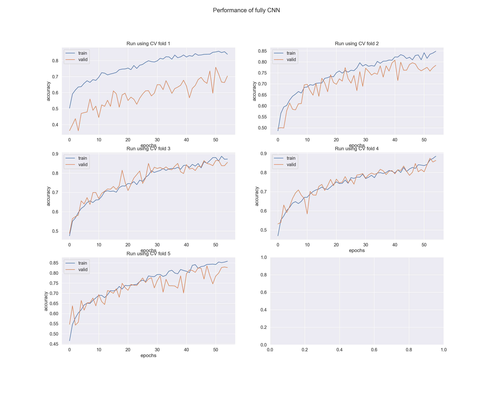

# Machine Learning Engineer Nanodegree
# Capstone Project

Hala Jadallah

May, 14 2019

# I. Definition
### Project Overview

There is a big interest in delegating certain type of jobs to robots that need no human assistance. Unlike humans, robots are more designed to do repetitive jobs, with small variability and with fatigue. They can also do nightshift jobs when humans are less effective and naturally need restorative sleep. 

In this project we consider an application where we help an autonomous mobile robot armed with data obtained from Inertial Measurement Units (IMU sensors) to identify the type of surface they are moving on from a list of 9 surface types: carpet, concrete, fine concrete, hard tiles, hard tiles large space, soft-pvc, soft tiles, tiled, and wood. 
The sensors give readings of orientation in quaternion form, angular velocity along the x, y, z directions and linear acceleration along the x, y, and z directions.

The data comes from one of [Kaggle’s competitions](https://www.kaggle.com/c/career-con-2019) and is provided by researchers at Tampere University, that have an active program in robotics. The researchers want the robots to identify the surface on their own just by sensor input so that they can adjust their navigation that suits the surface so that, for example, they avoid falling while moving. 

The researchers had the mobile robots move on nine different surfaces and recorded the data by series numbers and group numbers. Each series has 10 features: the four quaternion variables (orientation_x, orientation_y, orientation_z, orientation_w), velocity (angular_velocity_x, angular_velocity_y, angular_velocity_z) and acceleration (linear_acceleration_x, linear_acceleration_y, linear_acceleration_z).  

Each series variable has 128-unit steps. The group ids or numbers identify recordings that were done together.  
In this project I will train the data with series recordings that are identified with a surface, so that we can predict the surface for series data that is not identified with a surface. 

### Problem Statement

As I described in the project overview section, the researchers want the autonomous mobile robot be able to use sensor data to identify the surface type (out of the nine types) they are moving on. 

Since the sensor data are series of orientation, velocity and acceleration each with 128-unit steps, we obviously have multi-variable time series classification problem. There are several methods that are used for such a task. Some are indicated in the UCR time series archive website. Recently there are efforts to use deep learning for classifying time series.

I am interested in using deep learning for this classification task. Deep learning is based on using multi layered neural networks that are either fully connected layers FC, convolution neural networks (CNN) or long short-term memory recurrent neural networks (LSTM), or even a mix of these. 

CNNs are known to classify images, a two-dimensional object. On the other other hand for series, a one-dimensional object, they can learn the shape of the series for the 10 variables to learn classifying them.   

LSTMs on the other hand, are designed for sequential data so that it exploits the correlation along the sequence. 

Any deep learning architecture must end with at least one fully connected (FC) layer and a “softmax” activation function  that give the probability of a series belonging to each of the class types, where we assign (classify) the series to the class with the highest probability.     

### Metrics
For classification one can use accuracy (as dictated by Kaggle’s competition). For this project as we will see below, the classes are not balanced, therefore multiclass accuracy may not be reliable. I would visually inspect the confusion matrix and compute F1-score which maybe considered as an interpolation between recall and precision. I use ‘macro’ averaging in computing F1-score, that is, the F1-score for each class is computed and then the nine F1-scores are averaged.  

# II. Analysis

### Data Exploration
The data set is comprised of `y-train` data that has 3810 rows and three columns: the `series_id`, the `group_id` and `surface` type corresponding to the series. Each group_id correspond to only one surface. However, each surface corresponds to multiple groups. 

Each series_id in the y_train dataset, correspond to a 128-unit step timeseries in the X_train dataset. Thus, is has 487680 (=128*3810) rows and 13 columns: `row_id`, `series_id`, `measrement_num`, `orientation_X`, `orientation_Y`, `orientation_Z`, `orientation_W`, `angular_velosity_X`, `angular_velocity_Y`, `angular_velocity_Z`, `linear_acceleration_X`, `linear_acceleration_Y`, `linear_acceleration_Z`. 

There are no missing values in this dataset. Most variables are float or integer. The `surface` variable and `row_id` are  character variables 

The main data variables should be considered as time series each of length 128. In fact, a multivariate time series, where the variables fall in the three main categories: orientation, angular velocity and linear acceleration. Each time series correspond to one class (surface). 


```python
import pandas as pd
import numpy as np
# read in train and test sensor data
data_train = pd.read_csv('X_train.csv')
data_test = pd.read_csv('X_test.csv')
```


```python
y_train = pd.read_csv('y_train.csv')
Xy_train = data_train.join(y_train[['surface','group_id']], on='series_id')
```

**Table 1 a.** A sample of the data features shows the series_id of the first series, measurement number from 0 to 127, and then the main features.  


```python
data_train.head()
```


<div>


<table border="1" class="dataframe">
  <thead>
    <tr style="text-align: right;">
      <th></th>
      <th>row_id</th>
      <th>series_id</th>
      <th>measurement_number</th>
      <th>orientation_X</th>
      <th>orientation_Y</th>
      <th>orientation_Z</th>
      <th>orientation_W</th>
      <th>angular_velocity_X</th>
      <th>angular_velocity_Y</th>
      <th>angular_velocity_Z</th>
      <th>linear_acceleration_X</th>
      <th>linear_acceleration_Y</th>
      <th>linear_acceleration_Z</th>
    </tr>
  </thead>
  <tbody>
    <tr>
      <th>0</th>
      <td>0_0</td>
      <td>0</td>
      <td>0</td>
      <td>-0.75853</td>
      <td>-0.63435</td>
      <td>-0.10488</td>
      <td>-0.10597</td>
      <td>0.107650</td>
      <td>0.017561</td>
      <td>0.000767</td>
      <td>-0.74857</td>
      <td>2.1030</td>
      <td>-9.7532</td>
    </tr>
    <tr>
      <th>1</th>
      <td>0_1</td>
      <td>0</td>
      <td>1</td>
      <td>-0.75853</td>
      <td>-0.63434</td>
      <td>-0.10490</td>
      <td>-0.10600</td>
      <td>0.067851</td>
      <td>0.029939</td>
      <td>0.003385</td>
      <td>0.33995</td>
      <td>1.5064</td>
      <td>-9.4128</td>
    </tr>
    <tr>
      <th>2</th>
      <td>0_2</td>
      <td>0</td>
      <td>2</td>
      <td>-0.75853</td>
      <td>-0.63435</td>
      <td>-0.10492</td>
      <td>-0.10597</td>
      <td>0.007275</td>
      <td>0.028934</td>
      <td>-0.005978</td>
      <td>-0.26429</td>
      <td>1.5922</td>
      <td>-8.7267</td>
    </tr>
    <tr>
      <th>3</th>
      <td>0_3</td>
      <td>0</td>
      <td>3</td>
      <td>-0.75852</td>
      <td>-0.63436</td>
      <td>-0.10495</td>
      <td>-0.10597</td>
      <td>-0.013053</td>
      <td>0.019448</td>
      <td>-0.008974</td>
      <td>0.42684</td>
      <td>1.0993</td>
      <td>-10.0960</td>
    </tr>
    <tr>
      <th>4</th>
      <td>0_4</td>
      <td>0</td>
      <td>4</td>
      <td>-0.75852</td>
      <td>-0.63435</td>
      <td>-0.10495</td>
      <td>-0.10596</td>
      <td>0.005135</td>
      <td>0.007652</td>
      <td>0.005245</td>
      <td>-0.50969</td>
      <td>1.4689</td>
      <td>-10.4410</td>
    </tr>
  </tbody>
</table>
</div>


**Table 1 b.** A sample of the target variables


```python
y_train.head()
```


<div>

<table border="1" class="dataframe">
  <thead>
    <tr style="text-align: right;">
      <th></th>
      <th>series_id</th>
      <th>group_id</th>
      <th>surface</th>
    </tr>
  </thead>
  <tbody>
    <tr>
      <th>0</th>
      <td>0</td>
      <td>13</td>
      <td>fine_concrete</td>
    </tr>
    <tr>
      <th>1</th>
      <td>1</td>
      <td>31</td>
      <td>concrete</td>
    </tr>
    <tr>
      <th>2</th>
      <td>2</td>
      <td>20</td>
      <td>concrete</td>
    </tr>
    <tr>
      <th>3</th>
      <td>3</td>
      <td>31</td>
      <td>concrete</td>
    </tr>
    <tr>
      <th>4</th>
      <td>4</td>
      <td>22</td>
      <td>soft_tiles</td>
    </tr>
  </tbody>
</table>
</div>


**Table 2.** the main statistics of the features over all series. We observe the orientation variables lie between -1 and 1. The angular velocity variables have a slightly wider range. While the linear acceleration variables have more extreme variables. 


```python
data_train.iloc[:,3:].describe()
```


<div>

<table border="1" class="dataframe">
  <thead>
    <tr style="text-align: right;">
      <th></th>
      <th>orientation_X</th>
      <th>orientation_Y</th>
      <th>orientation_Z</th>
      <th>orientation_W</th>
      <th>angular_velocity_X</th>
      <th>angular_velocity_Y</th>
      <th>angular_velocity_Z</th>
      <th>linear_acceleration_X</th>
      <th>linear_acceleration_Y</th>
      <th>linear_acceleration_Z</th>
    </tr>
  </thead>
  <tbody>
    <tr>
      <th>count</th>
      <td>487680.000000</td>
      <td>487680.000000</td>
      <td>487680.000000</td>
      <td>487680.000000</td>
      <td>487680.000000</td>
      <td>487680.000000</td>
      <td>487680.000000</td>
      <td>487680.000000</td>
      <td>487680.000000</td>
      <td>487680.000000</td>
    </tr>
    <tr>
      <th>mean</th>
      <td>-0.018050</td>
      <td>0.075062</td>
      <td>0.012458</td>
      <td>-0.003804</td>
      <td>0.000178</td>
      <td>0.008338</td>
      <td>-0.019184</td>
      <td>0.129281</td>
      <td>2.886468</td>
      <td>-9.364886</td>
    </tr>
    <tr>
      <th>std</th>
      <td>0.685696</td>
      <td>0.708226</td>
      <td>0.105972</td>
      <td>0.104299</td>
      <td>0.117764</td>
      <td>0.088677</td>
      <td>0.229153</td>
      <td>1.870600</td>
      <td>2.140067</td>
      <td>2.845341</td>
    </tr>
    <tr>
      <th>min</th>
      <td>-0.989100</td>
      <td>-0.989650</td>
      <td>-0.162830</td>
      <td>-0.156620</td>
      <td>-2.371000</td>
      <td>-0.927860</td>
      <td>-1.268800</td>
      <td>-36.067000</td>
      <td>-121.490000</td>
      <td>-75.386000</td>
    </tr>
    <tr>
      <th>25%</th>
      <td>-0.705120</td>
      <td>-0.688980</td>
      <td>-0.089466</td>
      <td>-0.106060</td>
      <td>-0.040752</td>
      <td>-0.033191</td>
      <td>-0.090743</td>
      <td>-0.530833</td>
      <td>1.957900</td>
      <td>-10.193000</td>
    </tr>
    <tr>
      <th>50%</th>
      <td>-0.105960</td>
      <td>0.237855</td>
      <td>0.031949</td>
      <td>-0.018704</td>
      <td>0.000084</td>
      <td>0.005412</td>
      <td>-0.005335</td>
      <td>0.124980</td>
      <td>2.879600</td>
      <td>-9.365300</td>
    </tr>
    <tr>
      <th>75%</th>
      <td>0.651803</td>
      <td>0.809550</td>
      <td>0.122870</td>
      <td>0.097215</td>
      <td>0.040527</td>
      <td>0.048068</td>
      <td>0.064604</td>
      <td>0.792263</td>
      <td>3.798800</td>
      <td>-8.522700</td>
    </tr>
    <tr>
      <th>max</th>
      <td>0.989100</td>
      <td>0.988980</td>
      <td>0.155710</td>
      <td>0.154770</td>
      <td>2.282200</td>
      <td>1.079100</td>
      <td>1.387300</td>
      <td>36.797000</td>
      <td>73.008000</td>
      <td>65.839000</td>
    </tr>
  </tbody>
</table>
</div>


__Table 3.__ The mean of variables by surfaces show slight variability between surfaces


```python
train = Xy_train.drop(['row_id','measurement_number','group_id', 'series_id'], axis=1)
data_by_surface = train.groupby('surface')
data_by_surface.mean()
```


<div>

<table border="1" class="dataframe">
  <thead>
    <tr style="text-align: right;">
      <th></th>
      <th>orientation_X</th>
      <th>orientation_Y</th>
      <th>orientation_Z</th>
      <th>orientation_W</th>
      <th>angular_velocity_X</th>
      <th>angular_velocity_Y</th>
      <th>angular_velocity_Z</th>
      <th>linear_acceleration_X</th>
      <th>linear_acceleration_Y</th>
      <th>linear_acceleration_Z</th>
    </tr>
    <tr>
      <th>surface</th>
      <th></th>
      <th></th>
      <th></th>
      <th></th>
      <th></th>
      <th></th>
      <th></th>
      <th></th>
      <th></th>
      <th></th>
    </tr>
  </thead>
  <tbody>
    <tr>
      <th>carpet</th>
      <td>-0.385794</td>
      <td>0.232877</td>
      <td>0.032506</td>
      <td>-0.060315</td>
      <td>0.001029</td>
      <td>0.024627</td>
      <td>-0.072238</td>
      <td>0.091456</td>
      <td>2.872431</td>
      <td>-9.368058</td>
    </tr>
    <tr>
      <th>concrete</th>
      <td>-0.207607</td>
      <td>0.078932</td>
      <td>0.010351</td>
      <td>-0.032107</td>
      <td>0.000925</td>
      <td>0.021816</td>
      <td>-0.062718</td>
      <td>0.111593</td>
      <td>2.907733</td>
      <td>-9.356408</td>
    </tr>
    <tr>
      <th>fine_concrete</th>
      <td>-0.143290</td>
      <td>0.188151</td>
      <td>0.028501</td>
      <td>-0.021683</td>
      <td>-0.000099</td>
      <td>0.003167</td>
      <td>-0.002443</td>
      <td>0.136297</td>
      <td>2.922102</td>
      <td>-9.356070</td>
    </tr>
    <tr>
      <th>hard_tiles</th>
      <td>0.650556</td>
      <td>-0.735114</td>
      <td>-0.106206</td>
      <td>0.103824</td>
      <td>-0.000176</td>
      <td>-0.006708</td>
      <td>0.026448</td>
      <td>0.145759</td>
      <td>2.990207</td>
      <td>-9.332681</td>
    </tr>
    <tr>
      <th>hard_tiles_large_space</th>
      <td>0.393165</td>
      <td>-0.113644</td>
      <td>-0.014866</td>
      <td>0.060699</td>
      <td>0.000434</td>
      <td>0.016397</td>
      <td>-0.044681</td>
      <td>0.110250</td>
      <td>2.885197</td>
      <td>-9.365567</td>
    </tr>
    <tr>
      <th>soft_pvc</th>
      <td>0.309570</td>
      <td>-0.011457</td>
      <td>0.005433</td>
      <td>0.043331</td>
      <td>0.000692</td>
      <td>0.014869</td>
      <td>-0.040387</td>
      <td>0.128839</td>
      <td>2.811946</td>
      <td>-9.386315</td>
    </tr>
    <tr>
      <th>soft_tiles</th>
      <td>0.276689</td>
      <td>0.017786</td>
      <td>0.004524</td>
      <td>0.042025</td>
      <td>0.000640</td>
      <td>0.017502</td>
      <td>-0.048913</td>
      <td>0.084119</td>
      <td>2.914124</td>
      <td>-9.359474</td>
    </tr>
    <tr>
      <th>tiled</th>
      <td>-0.275754</td>
      <td>0.075003</td>
      <td>0.010869</td>
      <td>-0.042090</td>
      <td>0.000102</td>
      <td>0.006403</td>
      <td>-0.012668</td>
      <td>0.135560</td>
      <td>2.913803</td>
      <td>-9.357045</td>
    </tr>
    <tr>
      <th>wood</th>
      <td>-0.138246</td>
      <td>0.209518</td>
      <td>0.030993</td>
      <td>-0.022491</td>
      <td>-0.001783</td>
      <td>-0.025233</td>
      <td>0.089153</td>
      <td>0.185963</td>
      <td>2.892481</td>
      <td>-9.364265</td>
    </tr>
  </tbody>
</table>
</div>


__Table 4.__ The standard deviation of series corresponding to the same surface. The values are reasonable. We only find slight variability between srufaces in the acceleration features. 


```python
data_by_surface.std()
```


<div>

<table border="1" class="dataframe">
  <thead>
    <tr style="text-align: right;">
      <th></th>
      <th>orientation_X</th>
      <th>orientation_Y</th>
      <th>orientation_Z</th>
      <th>orientation_W</th>
      <th>angular_velocity_X</th>
      <th>angular_velocity_Y</th>
      <th>angular_velocity_Z</th>
      <th>linear_acceleration_X</th>
      <th>linear_acceleration_Y</th>
      <th>linear_acceleration_Z</th>
    </tr>
    <tr>
      <th>surface</th>
      <th></th>
      <th></th>
      <th></th>
      <th></th>
      <th></th>
      <th></th>
      <th></th>
      <th></th>
      <th></th>
      <th></th>
    </tr>
  </thead>
  <tbody>
    <tr>
      <th>carpet</th>
      <td>0.558090</td>
      <td>0.680656</td>
      <td>0.103843</td>
      <td>0.082027</td>
      <td>0.103999</td>
      <td>0.087537</td>
      <td>0.223227</td>
      <td>2.033440</td>
      <td>2.562971</td>
      <td>2.288149</td>
    </tr>
    <tr>
      <th>concrete</th>
      <td>0.724844</td>
      <td>0.634656</td>
      <td>0.095181</td>
      <td>0.110878</td>
      <td>0.154918</td>
      <td>0.097308</td>
      <td>0.222090</td>
      <td>2.581342</td>
      <td>3.096531</td>
      <td>3.726617</td>
    </tr>
    <tr>
      <th>fine_concrete</th>
      <td>0.628582</td>
      <td>0.725514</td>
      <td>0.111411</td>
      <td>0.094375</td>
      <td>0.085643</td>
      <td>0.080723</td>
      <td>0.221343</td>
      <td>1.379338</td>
      <td>1.601250</td>
      <td>2.047193</td>
    </tr>
    <tr>
      <th>hard_tiles</th>
      <td>0.090707</td>
      <td>0.075925</td>
      <td>0.011803</td>
      <td>0.014121</td>
      <td>0.032907</td>
      <td>0.072593</td>
      <td>0.226314</td>
      <td>0.521849</td>
      <td>0.945227</td>
      <td>0.599659</td>
    </tr>
    <tr>
      <th>hard_tiles_large_space</th>
      <td>0.522936</td>
      <td>0.732409</td>
      <td>0.113010</td>
      <td>0.077233</td>
      <td>0.195604</td>
      <td>0.097617</td>
      <td>0.188297</td>
      <td>2.832893</td>
      <td>2.578976</td>
      <td>4.866550</td>
    </tr>
    <tr>
      <th>soft_pvc</th>
      <td>0.612270</td>
      <td>0.712656</td>
      <td>0.102576</td>
      <td>0.094142</td>
      <td>0.058173</td>
      <td>0.057497</td>
      <td>0.157295</td>
      <td>0.944897</td>
      <td>1.356420</td>
      <td>1.235721</td>
    </tr>
    <tr>
      <th>soft_tiles</th>
      <td>0.669783</td>
      <td>0.672457</td>
      <td>0.100333</td>
      <td>0.102425</td>
      <td>0.030014</td>
      <td>0.041384</td>
      <td>0.124861</td>
      <td>0.537524</td>
      <td>0.872669</td>
      <td>0.485342</td>
    </tr>
    <tr>
      <th>tiled</th>
      <td>0.589763</td>
      <td>0.740189</td>
      <td>0.110952</td>
      <td>0.091911</td>
      <td>0.141375</td>
      <td>0.082908</td>
      <td>0.165605</td>
      <td>2.114298</td>
      <td>2.251182</td>
      <td>3.489906</td>
    </tr>
    <tr>
      <th>wood</th>
      <td>0.630122</td>
      <td>0.719346</td>
      <td>0.109419</td>
      <td>0.095142</td>
      <td>0.087131</td>
      <td>0.116900</td>
      <td>0.352725</td>
      <td>1.377191</td>
      <td>1.601598</td>
      <td>2.134775</td>
    </tr>
  </tbody>
</table>
</div>


__Table 5.__ The maximum value of series corresponding to the same surface. 


```python
data_by_surface.max()
```


<div>

<table border="1" class="dataframe">
  <thead>
    <tr style="text-align: right;">
      <th></th>
      <th>orientation_X</th>
      <th>orientation_Y</th>
      <th>orientation_Z</th>
      <th>orientation_W</th>
      <th>angular_velocity_X</th>
      <th>angular_velocity_Y</th>
      <th>angular_velocity_Z</th>
      <th>linear_acceleration_X</th>
      <th>linear_acceleration_Y</th>
      <th>linear_acceleration_Z</th>
    </tr>
    <tr>
      <th>surface</th>
      <th></th>
      <th></th>
      <th></th>
      <th></th>
      <th></th>
      <th></th>
      <th></th>
      <th></th>
      <th></th>
      <th></th>
    </tr>
  </thead>
  <tbody>
    <tr>
      <th>carpet</th>
      <td>0.38137</td>
      <td>0.98207</td>
      <td>0.155660</td>
      <td>0.052329</td>
      <td>1.21160</td>
      <td>0.93619</td>
      <td>1.12570</td>
      <td>23.2930</td>
      <td>32.6230</td>
      <td>22.3360</td>
    </tr>
    <tr>
      <th>concrete</th>
      <td>0.98889</td>
      <td>0.98898</td>
      <td>0.148380</td>
      <td>0.151540</td>
      <td>2.28220</td>
      <td>0.83621</td>
      <td>1.38730</td>
      <td>36.7970</td>
      <td>73.0080</td>
      <td>65.8390</td>
    </tr>
    <tr>
      <th>fine_concrete</th>
      <td>0.98642</td>
      <td>0.98866</td>
      <td>0.151470</td>
      <td>0.154770</td>
      <td>0.71355</td>
      <td>0.46764</td>
      <td>0.94021</td>
      <td>12.3940</td>
      <td>16.4520</td>
      <td>7.1959</td>
    </tr>
    <tr>
      <th>hard_tiles</th>
      <td>0.74929</td>
      <td>-0.64475</td>
      <td>-0.092761</td>
      <td>0.119020</td>
      <td>0.16933</td>
      <td>0.14701</td>
      <td>0.44347</td>
      <td>1.8960</td>
      <td>7.1469</td>
      <td>-7.1307</td>
    </tr>
    <tr>
      <th>hard_tiles_large_space</th>
      <td>0.98872</td>
      <td>0.98840</td>
      <td>0.150650</td>
      <td>0.151870</td>
      <td>1.19500</td>
      <td>1.07910</td>
      <td>0.97221</td>
      <td>24.9450</td>
      <td>20.0050</td>
      <td>20.4500</td>
    </tr>
    <tr>
      <th>soft_pvc</th>
      <td>0.98910</td>
      <td>0.98865</td>
      <td>0.152640</td>
      <td>0.149570</td>
      <td>0.86514</td>
      <td>0.42471</td>
      <td>0.48411</td>
      <td>10.7160</td>
      <td>18.5010</td>
      <td>15.9830</td>
    </tr>
    <tr>
      <th>soft_tiles</th>
      <td>0.98874</td>
      <td>0.98876</td>
      <td>0.150090</td>
      <td>0.149850</td>
      <td>0.41735</td>
      <td>0.28317</td>
      <td>0.66076</td>
      <td>8.8783</td>
      <td>11.8770</td>
      <td>-3.0539</td>
    </tr>
    <tr>
      <th>tiled</th>
      <td>0.95521</td>
      <td>0.98747</td>
      <td>0.151760</td>
      <td>0.153950</td>
      <td>0.95938</td>
      <td>0.54884</td>
      <td>0.83011</td>
      <td>18.8060</td>
      <td>17.9990</td>
      <td>20.4310</td>
    </tr>
    <tr>
      <th>wood</th>
      <td>0.98865</td>
      <td>0.98893</td>
      <td>0.155710</td>
      <td>0.151500</td>
      <td>0.76485</td>
      <td>0.35950</td>
      <td>0.97238</td>
      <td>15.0530</td>
      <td>14.5110</td>
      <td>12.7350</td>
    </tr>
  </tbody>
</table>
</div>


__Table 6.__ The minimum value of series corresponding to the same surface. 


```python
data_by_surface.min()
```


<div>

<table border="1" class="dataframe">
  <thead>
    <tr style="text-align: right;">
      <th></th>
      <th>orientation_X</th>
      <th>orientation_Y</th>
      <th>orientation_Z</th>
      <th>orientation_W</th>
      <th>angular_velocity_X</th>
      <th>angular_velocity_Y</th>
      <th>angular_velocity_Z</th>
      <th>linear_acceleration_X</th>
      <th>linear_acceleration_Y</th>
      <th>linear_acceleration_Z</th>
    </tr>
    <tr>
      <th>surface</th>
      <th></th>
      <th></th>
      <th></th>
      <th></th>
      <th></th>
      <th></th>
      <th></th>
      <th></th>
      <th></th>
      <th></th>
    </tr>
  </thead>
  <tbody>
    <tr>
      <th>carpet</th>
      <td>-0.98859</td>
      <td>-0.98905</td>
      <td>-0.15054</td>
      <td>-0.153450</td>
      <td>-1.05470</td>
      <td>-0.92786</td>
      <td>-1.24450</td>
      <td>-29.8950</td>
      <td>-54.5910</td>
      <td>-49.403</td>
    </tr>
    <tr>
      <th>concrete</th>
      <td>-0.98862</td>
      <td>-0.96579</td>
      <td>-0.14873</td>
      <td>-0.151860</td>
      <td>-2.37100</td>
      <td>-0.90875</td>
      <td>-1.25930</td>
      <td>-36.0670</td>
      <td>-121.4900</td>
      <td>-75.386</td>
    </tr>
    <tr>
      <th>fine_concrete</th>
      <td>-0.89089</td>
      <td>-0.98866</td>
      <td>-0.15396</td>
      <td>-0.137720</td>
      <td>-0.61259</td>
      <td>-0.36092</td>
      <td>-0.82227</td>
      <td>-10.9300</td>
      <td>-9.6574</td>
      <td>-24.686</td>
    </tr>
    <tr>
      <th>hard_tiles</th>
      <td>0.46074</td>
      <td>-0.87507</td>
      <td>-0.12841</td>
      <td>0.074212</td>
      <td>-0.12939</td>
      <td>-0.15695</td>
      <td>-0.33992</td>
      <td>-2.2821</td>
      <td>-1.2135</td>
      <td>-11.452</td>
    </tr>
    <tr>
      <th>hard_tiles_large_space</th>
      <td>-0.71222</td>
      <td>-0.98965</td>
      <td>-0.15189</td>
      <td>-0.120190</td>
      <td>-1.24550</td>
      <td>-0.82208</td>
      <td>-0.98636</td>
      <td>-21.2210</td>
      <td>-23.7140</td>
      <td>-41.542</td>
    </tr>
    <tr>
      <th>soft_pvc</th>
      <td>-0.97853</td>
      <td>-0.91465</td>
      <td>-0.16283</td>
      <td>-0.147770</td>
      <td>-0.64247</td>
      <td>-0.46152</td>
      <td>-1.26880</td>
      <td>-11.5050</td>
      <td>-26.8300</td>
      <td>-27.907</td>
    </tr>
    <tr>
      <th>soft_tiles</th>
      <td>-0.96457</td>
      <td>-0.96176</td>
      <td>-0.14454</td>
      <td>-0.147440</td>
      <td>-0.38121</td>
      <td>-0.37008</td>
      <td>-0.41884</td>
      <td>-9.8046</td>
      <td>-6.9817</td>
      <td>-18.902</td>
    </tr>
    <tr>
      <th>tiled</th>
      <td>-0.98910</td>
      <td>-0.98908</td>
      <td>-0.15101</td>
      <td>-0.156620</td>
      <td>-1.02440</td>
      <td>-0.49977</td>
      <td>-0.77189</td>
      <td>-16.0290</td>
      <td>-20.9990</td>
      <td>-37.273</td>
    </tr>
    <tr>
      <th>wood</th>
      <td>-0.98872</td>
      <td>-0.98883</td>
      <td>-0.15023</td>
      <td>-0.153400</td>
      <td>-0.91480</td>
      <td>-0.52811</td>
      <td>-0.91822</td>
      <td>-12.5060</td>
      <td>-10.4040</td>
      <td>-32.114</td>
    </tr>
  </tbody>
</table>
</div>


### Visualizing
#### Figure 1: Class distirbution. 
Observe suraces are not uniformly distributed in this data. This means we need to keep an eye on the learning algorithm that it does not undersample from low frequency classes. 


#### Figure 2: Density Curves by class
Density curves here show the most variability in orientation curves. These curves have density curves that seem to be distinct for each surface, either by the mode location or number (since most appear to be multi-modal). The angular velocity shows some distinct behavior among few classes, but mostly unimodal centered around zero. The linear acceleration is the most concentrated about zero with much less spread, although some series take extreme values.
However, as the figure below shows the series have a lot of noise that the density curves do not reveal. 


#### Figure 3: Sample plots of a random series
Notice the high noise on top of oscillatory curve around a constant mean or a trend of either increasing, decreasing
for a sample series corresponding to “soft tiles” surface. The first row has the orientation variables with increasing or decreasing trend. Followed by the velocity variables in the second row and acceleration variables in the third row all plotted against the measurement unit from 0 to 127.


#### Figure 4: Feature plots by class
The plots demonstrate random series sampled from each class. To reduce the noise, the curves have been smoothed using a 7-point moving average.
Although the curves oscillate about a common mean, particularly along the x and y directions, we observe the frequency and (to a lesser degree) the amplitude vary from class to another. We also observe that the mean of acceleration along the z direction is much lower than the other two directions.





### Algorithms and Techniques
I choose to solve the multivariate time series classification using deep learning. Specifically, I use convolutional neural networks, since these incorporate applying filters that consider correlations in neighboring data along the signal. 
Convolutional neural networks usually have convolutional layers each is described by the number of filters, kernel size of each filter, the stride of each filter as it computed the parameters of each filter and the padding type whether there should be no padding, or zero padding. There is also activation layers, batch normalization layers and pooling layers. 
I test several architectures and use cross validation to choose the best. 

For model validation I split the data into k folds for cross validation. I compared two strategies for splitting. The first respect class distribution and so folds are sampled by stratification. 

The second strategy, use the ‘group_id’ as a guide, so that validation fold does not come from groups in the other folds. This is necessary because it is suspected that series within the same group are correlated, that they were done consecutively successively and therefore one should take care to get a meaningful validation score by separating series based on groups. 

### Benchmark
One common method that I found used in a number of kernels regarding this competition was based on finding aggregate statistics for each time series so that the data is now tabular. Then it becomes a typical classification problem. I used random forests, a decision tree ensemble algorithm, where it chooses the best tree among randomly decision trees for classification. 

Results: multiclass accuracy

|Model| 	 accuracy Validation|	Kaggle Public| Kaggle	Private|
|:-----|:--------|:------|:-----|
|splitting by stratification|	0.7963|	0.5747|	0.4571|
|splitting by groups|	0.3973|	0.5765|	0.4225|


# III. Methodology

### Data Preprocessing

I standadize the data by z-normalization that is subtract the values from the mean of a feature of all series and devide by the standard deviation. This reduces any influence of the scale of the training data. Moreover, any test data would be more comparable when all data that is used to fit the model, scale-wise. 


### Implementation
I attempted three models of different architectures using convolutional neural networks.

**Model 1:** The input to the model involves three branches, one for the orientation variables, one for velocity variables and the last for the acceleration variables each is fed into a block that consists of: two consecutive convolutional layers with 16 and 32 filters respectively, stride one, kernel size of 5 and 3 respectively and with no padding. I used rectified linear unit for weights activation. Then I follow this with average pooling with pooling size of 2. I end this block with a `Batch-Normalization` layer. The output of this block is the input of the second block with exactly the same architecture. Next I merge the outputs of the second block of the three branches, and feed it into two blocks with the same type as above but the second replaces average pooling with a layer of Global Average Pooling, which is then followed by one fully connected layer with `softmax` activation function. 

**Model 2:** This model is a modification of the fully convolutional model mentioned in a [review paper](https://arxiv.org/abs/1809.04356). The model takes the whole data as an input to blocks each consist of one convolution layer followed by `BatchNormalization` layer, followed by activation layer using the rectified linear unit function. There are four blocks of this type with 32, 32, 64, 64 filters respectively, and a kernel size of 8, 5, 3, 3 respectively, and no padding.
The last block outputs feeds into a Global Average Pooling layer followed by a fully connected layers with `softmax` activation and L2 kernel regularization to reduce possible over fitting that was observed in Model 1. 

**Model 3:** This model is similar to Model 1. It has the same architecture before the merge of the three branches. After the merge there are no blocks just one convolution layer, `BatchNormalization` layer, Global Average Pooling and finally a fully connected layer with `softmax` activation, L2 regulirized as in Model 2.  

I defined the above models using Keras with Tensorflow backend. 
I compiled the model with ADAM optimzer, category-cross entropy loss function, and accuracy as the metric.  

Then I iterated over the 5 stratified folds selecting each one as a validation fold in each run with 55 or 60 epochs. 
I monitored the loss function and the accuracy for both the training folds and validation fold. Which can tell me how well the learning is proceeding and whether there is an over fitting to the training data. I also look at the confusion matrix after each run. 

When the learning and validation is done I compute the cross validation F1 score, and the multi-class accuracy. 

I ran the model on my personal laptop, with 1.70 GHz processor and 5.9 GB RAM.  


### Refinement
The model is refined manually which is not perfect. However, since deep learning takes a long time I had to take some common sense in my choices. The very first refinement was to realize that ADAM optimization give better resluts when the learning rate is 0.0005 rather than the default 0.001, I also checked a learning rate of 0.00001 but found that 0.0005 is better. 

I also checked whether no padding versus zero padding. The adjusted the number of filter and kernels and found the above choosen values gave better results. For example for Model 2, the paper suggests using filter of size 128 and 256, which I tried and got bad performance (worse than the bechmark), so I reduced the filters to 32 and 64 to get a better performance as documented below.   

I also checked the use of batch sizes per epoch to find that 15 is better for Model 1 and Model 3, but Model 2 can handle 32.


# IV. Results

### Model Evaluation and Validation
The method I used for model evaluation and validation is K fold cross validation. I tried two stratigies. One using splitting the data to 5 folds while maintaing the strata of the classe in each fold. Since the smallest class had 0.005 of the data, any fold shoud have about 700-800 series to get 3-4 series from the minority class on average in each fold. On the other hand having five folds give a better estimate which means that each fold will have 762 series. 

The second strategy has to do with the possibility that group id represent runs that where done together or sequentially so they are not independent. Since we do not have knowledge of the test data, splitting so that groups are not in the same group. This issue is recorded in this discussion between [competitots regarding groups being split between train and test](https://www.kaggle.com/c/career-con-2019/discussion/87239#latest-512162)

However, when I split by groups, I saw over fitting in the training data as I observed a wide gap between the train and test performance. I abondond this method of splitting to folds prefering stratification. 

Here are the results of the three models described above after refinement:

|Model| CV F1-score| CV accuracy| Kaggle public score| Kaggle private score|
|:----|:-----------|:-----------|:-------------------|:--------------------|
|Model 1| 0.7517| 0.7856| 0.6263| 0.5613|
|Model 2| 0.7823| 0.8056| 0.5753 | 0.5888 |
|Model 3| 0.8643| 0.8738| 0.6850| 0.6693|

Clearly, Model 3 does the best and out performs the bechmark model results. 

### Justification

In this problem, the convolution neural network seem to do a reasonable job predicting the surface the robot is moving on. However, I am not sure it can be generalized to the same robot moving on surfaces in different places not just a university premises. The issue I am talking about is the nature of train and test data and how independent from each other thay are.  
I am not fully satisfied with the results here. However deep learning takes time for training on my laptop. 

However, the results do better than the bechmark, but I cannot discuss this on a statistical basis, since I need to generate more testing data than what I have.  


# V. Conclusion

### Free Form Visualization

#### Figure 5.  Performance plots of different folds for the winning model.
We find the training and validation scores are close initially but then diverge slightly when compared Model 1, see below. 


#### Figure 6. Peforamance plots of Model 1. 
In the first 20 epochs are fine but after which we observe the over fitting. 



#### Figure 7. Performance plots of Model 2
Here except for the first run holding Fold 1 for validation, the training and the validation score are matching well and inidicates that probably if I let the training go for lonther epochs, a 100 say, I would get better final score. 


### Reflection

I describe in this section end-to-end solution. We started with exploring the data which is comprised of time series of 10 different variables. Each of 10-dimensional series represent a surface. We explored surface (class) distirbution to find it non-uniform. The 10 features series show variability that is not easily distinguishable visually. Next we standardized each feature series and reshape the series into three dimensional arrays, so that its applicable for convolution neural networks. 
The model training and validation were carried simultanuously. I split the data into 5 folds each stratified by class distribution and fit the model keeping one fold for validation. Model learning occurs over 50-60 epochs for each 5-fold turn and I keep an eye on the loss function and accuracy score for each epoch keeping in mind the possibility of over fitting. I see over fitting when the loss of the training folds is very small while the validation loss stays large. 

At the end I compute the accuracy as well as the F1 score for the overall model. 

There are several issues that I struggled with in this project one has to do with the role of groups (`group_is`) and whether I should take that into account in cross validation as I mensioned above. 

The second has to do with my intuition regarding orinetation variables.
Intuitively, I think that velocity and acceleration should be sufficient to detect the surface characteristics. I find it hard to grasp that orientation is important to surface recognition. However, as I write now I somewhat see orientation measured by quaternion is not the same as position. Orientation may reflect angular displacement with respect to a particular direction. For example, if the surface has some tiny microscopic pumps, then the robot may make some rotations with respect to some direction, not necessarily the direction of movement. In short I confused orientation with location or position of the robot. I spent a long time trying/adjusting models without orientation variable in the input data. 

I also considered fourier transform of the series, phase, autocorrelatioin funcion and the periodogram as feature engineering hopping that it will get better results. But none where better than the raw data and let the convolution layer filters compute the weights. 


### Improvement

To imporve on my results, I would try the following:

1. Let Model 2 go for longer epochs

2. Adjust the architecure of Model 1, by removing the pooling layers. 

3. Try recurrent neural network for time series classification

4. Try other methods mentioned in the review paper. 


# References:

H. Ismail Fawaz, G. Forestier, J. Weber, L. Idoumghar, P. Muller: "Deep learning for time series classification: a review",  [arXiv:1809.04356](https://arxiv.org/abs/1809.04356)

Kaggle discussion https://www.kaggle.com/c/career-con-2019/discussion/87239#latest-512162

Kaggle kernel https://www.kaggle.com/artgor/where-do-the-robots-drive

Kaggle kernel https://www.kaggle.com/gpreda/robots-need-help
